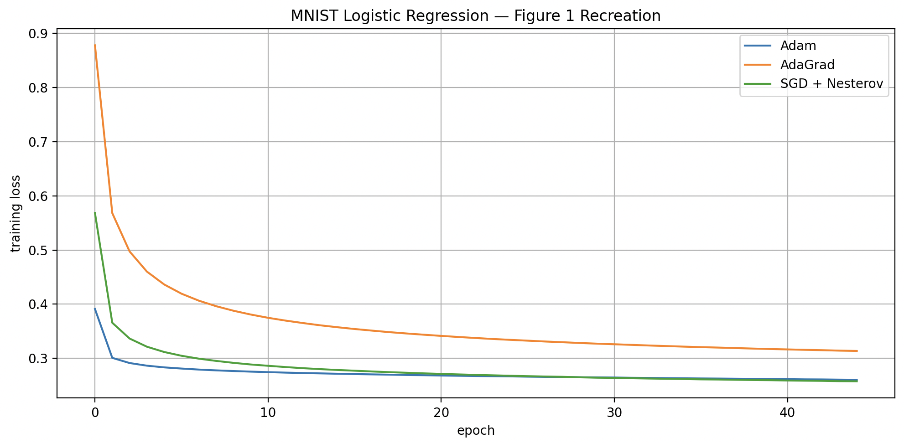
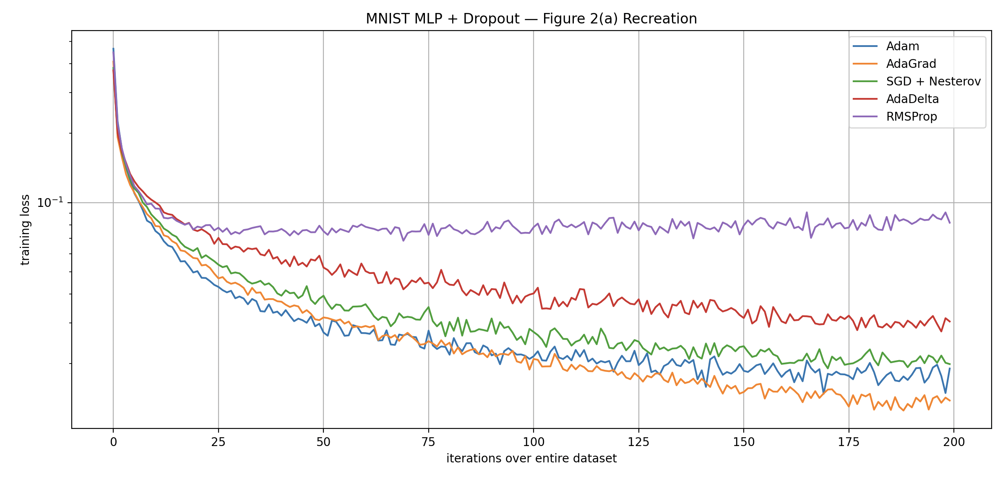

# Adam Optimizer Recreation

NumPy recreation of **"Adam: A Method for Stochastic Optimization"** (Kingma & Ba, ICLR 2015).

## Overview

This project implements Adam, AdaGrad, and SGD with Nesterov momentum from scratch in NumPy and reproduces the experiments from the original paper. No PyTorch autograd — all forward passes, backward passes, and optimizer update rules are hand-coded.

#### Interpretation

The corrected Adam implementation appears to be functioning much more plausibly than the initial version, but the reproduction is still not identical to the paper. The main remaining discrepancy is that AdaGrad outperforms Adam at the end of the 200-epoch run.
My current best hypotheses are:

1. The hyperparameter probe was too short.
   Adam was selected based on 15-epoch performance, where alpha=0.0003 beat AdaGrad. However, the full experiment is 200 epochs. AdaGrad’s cumulative squared-gradient accumulator naturally anneals its effective learning rate over time, which may explain why it continues improving while Adam plateaus.

2. Dropout + ReLU creates sparse/noisy gradients.
   AdaGrad is particularly strong in sparse-gradient settings. With ReLU activations and dropout, many units receive zeroed or intermittent gradients, which may make this implementation especially favorable to AdaGrad.

## Architecture

The codebase is organized so optimizers and the training loop are shared across
experiments; only the model changes per figure.

- `optimizers.py` — Adam, AdaGrad, SGD+Nesterov. Each operates on a single
  flattened parameter vector.
- `train.py` — model-agnostic training loop. Handles minibatching, seeded
  shuffling, per-epoch optimizer hooks, and pack/unpack at the optimizer boundary.
  Also contains `load_MNIST()`.
- `logreg.py` — logistic regression `forward` and `loss_and_grads`.
- `utils.py` — `one_hot`, `pack`/`unpack`, `plot_results`.
- `experiments.py` — thin runners (`run_figure1`, later `run_figure2`) that wire
  a model + optimizer into `train()`.

Regarding pack/unpack functions in utils.py: optimizers see one 1D vector regardless of the model. `pack([W, b, ...])` concatenates a list of arrays; `unpack(vector, shapes)` inverts it. This means
the same `Adam` instance handles logreg's 2 arrays (7,850 params) or the MLP's
6 arrays (1,796,010 params) with no code change.

## Experiments

### Figure 1: MNIST Logistic Regression

L2-regularized multi-class logistic regression on MNIST (784-dim image vectors, minibatch size 128). Adam's stepsize is annealed by 1/√t per epoch, matching the paper's Section 4 theoretical prediction.



**Result:** Adam and SGD+Nesterov converge together and both outperform AdaGrad, consistent with the paper's findings.

### Figure 2: MNIST MLP with Dropout

This experiment recreates Figure 2(a) from the Adam paper: training a multilayer perceptron on MNIST with dropout stochastic regularization. The original paper uses a neural network with two fully connected hidden layers of 1000 ReLU units each and minibatch size 128. It compares Adam, AdaGrad, RMSProp, SGD with Nesterov momentum, and AdaDelta on training cost over 200 passes through the full dataset.

Implemented optimizers:

- Adam
- AdaGrad
- SGD + Nesterov momentum
- RMSProp
- AdaDelta

#### Hyperparameter probes

Before running the full 200-epoch experiment, I ran 15-epoch probes to select learning rates:

```text
SGD+Nesterov alpha=0.003: 0.1343
SGD+Nesterov alpha=0.01:  0.0790
SGD+Nesterov alpha=0.03:  0.0725
SGD+Nesterov alpha=0.1:   1.0884

AdaGrad alpha=0.001: 0.2049
AdaGrad alpha=0.003: 0.1050
AdaGrad alpha=0.01:  0.0679
AdaGrad alpha=0.03:  0.1167

Adam alpha=0.0001: 0.0922
Adam alpha=0.0003: 0.0641
Adam alpha=0.001:  0.1016
Adam alpha=0.003:  0.2679

RMSProp alpha=0.0001: 0.1013
RMSProp alpha=0.0003: 0.0862
RMSProp alpha=0.001:  0.1899
RMSProp alpha=0.003:  0.4719
```

#### Selected Settings

Adam: alpha = 0.0003, beta1 = 0.9, beta2 = 0.999, epsilon = 1e-8
AdaGrad: alpha = 0.01, epsilon = 1e-8
SGD+Nesterov: alpha = 0.03, momentum = 0.9
RMSProp: alpha = 0.0003, decay = 0.9, epsilon = 1e-8
AdaDelta: rho = 0.95, epsilon = 1e-6, alpha = 1.0

### Results



The full 200-epoch run produced the following qualitative ordering:
AdaGrad reached the lowest final training loss.
Adam was highly competitive early, but plateaued above AdaGrad over the full 200 epochs.
SGD + Nesterov converged more slowly than Adam/AdaGrad early, but remained competitive.
AdaDelta improved steadily but stayed above Adam, AdaGrad, and SGD.
RMSProp plateaued early with the selected learning rate and performed the worst in this run.
This differs from the original paper, where Adam clearly outperforms the other first-order methods in Figure 2(a).

#### Interpretation

The corrected Adam implementation appears to be functioning much more plausibly than the initial version, but the reproduction is still not identical to the paper. The main remaining discrepancy is that AdaGrad outperforms Adam at the end of the 200-epoch run.
My current best hypotheses are:

1. The hyperparameter probe was too short.
   Adam was selected based on 15-epoch performance, where alpha=0.0003 beat AdaGrad. However, the full experiment is 200 epochs. AdaGrad’s cumulative squared-gradient accumulator naturally anneals its effective learning rate over time, which may explain why it continues improving while Adam plateaus.

2. Dropout + ReLU creates sparse/noisy gradients.
   AdaGrad is particularly strong in sparse-gradient settings. With ReLU activations and dropout, many units receive zeroed or intermittent gradients, which may make this implementation especially favorable to AdaGrad.

### Figure 3: CIFAR-10 CNN

_In progress_

## Implementation Notes

- **Variable naming** follows the paper exactly: `α=stepsize`, `β1=decay_1`, `β2=decay_2`, `ε=epsilon`, `θ=weights`, `g=grad`, `t=timestep`
- The `1/√t` stepsize decay applies **per epoch**, not per minibatch step, in experiment 1 (only).
- AdaGrad's learning rate already decays naturally via its accumulator; adding `1/√t` on top causes double decay and severely degrades performance

## File Structure

```

adam-recreation/
├── optimizers.py # Adam, AdaGrad, SGD_Nesterov, RMSProp, and AdaDelta classes
├── mlp.py # main model for multi-layer neural network in experiment 2
├── logreg.py # main model for logistic regression in experiment 1
├── utils.py # Helper functions like one-hot, pack, unpack
├── train.py # Training loop and data loading
├── experiments.py # Experiment calls and plots
└── assets/ # Output figures

```

## Usage

```bash
pip install numpy matplotlib torch torchvision
python experiments.py
```

## Reference

Kingma, D. P., & Ba, J. (2015). Adam: A Method for Stochastic Optimization. _ICLR 2015_. https://arxiv.org/abs/1412.6980
