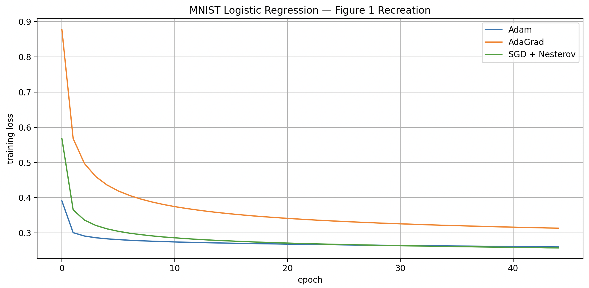
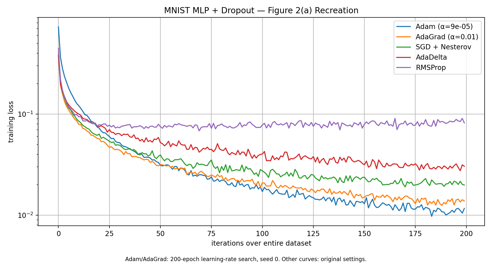
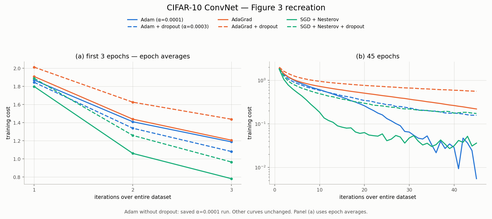

# Adam Optimizer Recreation

NumPy recreation of **"Adam: A Method for Stochastic Optimization"** (Kingma & Ba, ICLR 2015).

## Overview

This project implements optimizer updates in NumPy and recreates selected experiments from the original paper. The logistic regression, MLP, and VAE backward passes are hand-coded; the CNN uses PyTorch autograd for gradients and the same NumPy optimizer updates.

Bryan Zin wrote the repository through commit `d2abe01`. Later extensions include
AI-assisted work.

## Architecture

The codebase is organized so optimizers and the training loop are shared across
experiments; only the model changes per figure.

- `optimizers.py` — Adam, AdaGrad, SGD+Nesterov, RMSProp, AdaDelta, and AdaMax,
  each operating on a flattened parameter vector.
- `train.py` — model-agnostic training loop, seeded minibatching, pack/unpack at
  the optimizer boundary, and MNIST/CIFAR-10 loading.
- `logreg.py`, `mlp.py`, `cnn.py`, `vae.py` — models and gradient calculations.
- `utils.py` — `one_hot`, `pack`/`unpack`, `plot_results`.
- `experiments.py` — experiment settings, runs, checks, benchmarks, and plots.
- `figure2a_search.py`, `figure3_search.py` — checkpoint, worker, and supervisor
  code; grids and experiment entry points are in `experiments.py`.
- `test_figure2a_search.py`, `test_figure3_search.py` — search and resume checks.
- `assets/` — figures; `results/` — experiment records.

`pack([W, b, ...])` concatenates parameter arrays; `unpack(vector, shapes)` restores
them. Optimizers use the same interface for logistic regression's 7,850 parameters
and the MLP's 1,796,010 parameters.

## Experiments

### Figure 1: MNIST Logistic Regression

Historical MNIST logistic-regression chart. The retained baseline runner does not apply the paper's L2 regularization or epoch stepsize decay, and the original numerical histories are unavailable; this chart is not verified as an exact reproduction.



**Result:** Adam and SGD+Nesterov converge together and both outperform AdaGrad, consistent with the paper's findings.

### Figure 2(a): MNIST MLP with Dropout

This experiment recreates Figure 2(a) from the Adam paper: training a multilayer perceptron on MNIST with dropout stochastic regularization. The original paper uses a neural network with two fully connected hidden layers of 1000 ReLU units each and minibatch size 128. It compares Adam, AdaGrad, RMSProp, SGD with Nesterov momentum, and AdaDelta on training cost over 200 passes through the full dataset.

#### Original 15-epoch hyperparameter probes

The original 15-epoch probes selected learning rates for the 200-epoch baseline:

```text
SGD+Nesterov alpha=0.003: 0.1343
SGD+Nesterov alpha=0.01:  0.0790
SGD+Nesterov alpha=0.03:  0.0725
SGD+Nesterov alpha=0.1:   1.0884

AdaGrad alpha=0.001: 0.2049
AdaGrad alpha=0.003: 0.1050
AdaGrad alpha=0.01:  0.0679
AdaGrad alpha=0.03:  0.1167

Adam alpha=0.0001: 0.0922
Adam alpha=0.0003: 0.0641
Adam alpha=0.001:  0.1016
Adam alpha=0.003:  0.2679

RMSProp alpha=0.0001: 0.1013
RMSProp alpha=0.0003: 0.0862
RMSProp alpha=0.001:  0.1899
RMSProp alpha=0.003:  0.4719
```

#### Original settings

| Optimizer | Learning rate | Other settings |
|---|---:|---|
| Adam | 0.0003 | beta1=0.9, beta2=0.999, epsilon=1e-8 |
| AdaGrad | 0.01 | epsilon=1e-8 |
| SGD+Nesterov | 0.03 | momentum=0.9 |
| RMSProp | 0.0003 | decay=0.9, epsilon=1e-8 |
| AdaDelta | 1.0 | rho=0.95, epsilon=1e-6 |

#### Completed 200-epoch learning-rate search

Completed October 4, 2026 at 04:27 PDT: **26 of 26 trials**, each trained for **200 epochs**,
with no failed trials. Only Adam and AdaGrad were searched, using 13 learning
rates each and seed 0. Every trial resets the model, optimizer, and random state.

The grid multiplies Adam's original learning rate of `0.0003` and AdaGrad's
`0.01` by `[0.1, 0.15, 0.2, 0.3, 0.5, 0.7, 1, 1.5, 2, 3, 5, 7, 10]`.
Each optimizer is selected independently by its lowest **mean training loss over
epochs 181–200**, with epoch-200 loss and then lower learning rate breaking ties.
There is no pruning or automatic grid expansion. Neither selected rate is at a
grid boundary.

The architecture remains two 1000-unit ReLU hidden layers, with batch size 128,
20% input dropout, and 50% hidden dropout. Adam keeps `beta1=0.9`, `beta2=0.999`,
and `epsilon=1e-8`; AdaGrad keeps `epsilon=1e-8`. Only learning rates change.

| Optimizer | Selected learning rate | Mean loss, epochs 181–200 | Epoch-200 loss |
|---|---:|---:|---:|
| Adam | **0.00009** | **0.011057** | **0.011676** |
| AdaGrad | **0.01** | **0.013596** | **0.013831** |



Adam's selected trial has **18.7% lower final-20-epoch mean loss than AdaGrad**
and 38.0% lower than the original Adam trial at `0.0003` (mean loss `0.017839`).
AdaGrad's original rate remains its best. The SGD+Nesterov, RMSProp, and AdaDelta
curves use their original 200-epoch histories, verified byte-for-byte unchanged;
those optimizers were not searched again.

This supports the conclusion that selecting Adam's learning rate using only
15 epochs was insufficient for this 200-epoch objective. The result is closer
to the paper's late-training ordering, but does not establish an exact
reproduction: Adam is still slower early in this run, the search uses one seed,
and only learning rates for two optimizers were retuned. The retained dropout
rates are implementation choices, not verified settings from the Adam paper.

The [original chart](results/figure2a_search_20261002_v1/baseline/figure_2_recreation.png)
shows AdaGrad finishing below Adam. Trial histories, diagnostics, and source
hashes are linked under [Experiment records](#experiment-records).

### Figure 2(b): MLP without Dropout — Incomplete

The four-method comparison includes Adam, AdaMax, AdaGrad, and SGD+Nesterov.
SFO and L2 regularization are missing, so it is not a full reproduction.

### Figure 3: CIFAR-10 CNN

The local search ran on October 5, 2026, from approximately 17:09 to 22:00 PDT:
**38 of 38 trials completed**, with no failures. Every trial used 45 epochs,
seed 0, fresh parameters, optimizer state, and shuffle RNG.
Its archive and final chart are not included in this publication.

#### Search protocol

Stage 1 runs 22 trials across the following rates and both dropout conditions.
Adam beta1 and SGD momentum are 0.9.

| Optimizer | Learning rates | Trials |
|---|---|---:|
| Adam | 0.00006, 0.0001, 0.0003, 0.0006 | 8 |
| SGD+Nesterov | 0.003, 0.01, 0.03, 0.06 | 8 |
| AdaGrad | 0.001, 0.003, 0.01 | 6 |

Stage 2 adds 16 trials. For each Adam/SGD dropout condition, select the two best
finite completed stage-1 rates by mean training loss over epochs 41–45, then test
each at beta1/momentum 0.8 and 0.95. Freeze the shortlist and stage-1 result hashes.
Stop if a condition has fewer than two finite completed rates. Stage-1 trials at
0.9 remain eligible; AdaGrad has no momentum parameter.

Select each of the six optimizer/dropout conditions independently by mean loss
over epochs 41–45, then epoch-45 loss, lower learning rate, and lower momentum.
Flag boundary winners without expanding the grid. All stable trials run the full
45 epochs; there is no short-run pruning.

Fixed setup: whitened CIFAR-10, c64–c64–c128–1000 CNN, batch size 128, 20% input
and 50% hidden dropout when enabled, Adam beta2=0.999, epsilon=1e-8, and no
learning-rate schedule. Gradients use MPS; NumPy optimizer updates run on CPU.

Each epoch starts with `torch.manual_seed(master_seed + zero_based_epoch)`.
Torch 2.2.2 MPS RNG-state restoration alone did not reproduce dropout across
processes; this epoch seed policy reproduced losses, weights, optimizer moments,
and CPU/MPS RNG in the saved validation. Earlier trials using a continuous
dropout RNG stream are excluded from selection.

#### Selected runs

| Optimizer | Dropout | Learning rate | beta1 / momentum | Mean loss, epochs 41–45 |
|---|---|---:|---:|---:|
| Adam | No | 0.0001 | 0.9 | 0.002578 |
| Adam | Yes | 0.0003 | 0.8 | 0.134992 |
| AdaGrad | No | 0.003 | — | 0.223214 |
| AdaGrad | Yes | 0.003 | — | 0.573809 |
| SGD+Nesterov | No | 0.01 | 0.8 | 0.000106 |
| SGD+Nesterov | Yes | 0.01 | 0.8 | 0.119568 |

The completed-search chart uses these six runs in both panels. Panel (a) shows nonoverlapping means of 20
minibatches at their mean sub-epoch positions over the first three epochs, on a
linear loss axis. Panel (b) shows all 45 epoch means on a log axis. Raw minibatch
losses are retained in the local archive.



The published image above uses the [earlier saved histories](results/figure3_saved_update_20261005/manifest.json):
Adam without dropout at `0.0001` has epoch-45 loss `0.005508`, versus `0.089495`
for the previous `0.001` curve. The other five histories are unchanged. Its first
panel uses epoch averages, so it does not show the paper's within-epoch trajectory.
`plot_figure3()` uses this fallback when no completed search archive is available.

This grid is a reproduction choice, not the paper's unpublished dense tuning
grid. Rates outside the top two at momentum 0.9 may work better at other momenta
and are not all tested. Adam with dropout and both SGD winners reach the tested
momentum boundary of 0.8. One seed does not establish robustness, a global
optimum, or an exact paper reproduction.

### Figure 4: Bias Correction — Incomplete

The VAE runner records losses at epochs 10 and 100 and marks divergent
configurations. The full comparison remains incomplete; partial 10-epoch results
do not count as completed 100-epoch runs.

## Experiment records

| Search | Results | Manifest | Validation |
|---|---|---|---|
| [Figure 2(a) archive](results/figure2a_search_20261002_v1/) | [Trials and selection](results/figure2a_search_20261002_v1/search_results.json) | [Configuration and hashes](results/figure2a_search_20261002_v1/manifest.json) | [Checks](results/figure2a_search_20261002_v1/validation.json), [selected diagnostics](results/figure2a_search_20261002_v1/selected_diagnostics.json) |
| Figure 3 (local only) | `search_results.json`, `stage2.json` | `manifest.json` | `validation.json` |

The local Figure 3 records are under `results/figure3_search_20261005_v1/`.

Each archive contains `trials/<trial>/history.npy` and `result.json`, the exact
plotted histories in `chart_data/`, and an immutable training-time `source/`
snapshot. `baseline/` holds original figures and, for Figure 2(a), original
histories. Manifests record source, data, baseline, configuration, and environment
hashes or versions. `status.json` and
`events.jsonl` record progress and completion. Figure 3 also stores raw
`batch_losses.npy`. Read saved arrays with `numpy.load(path, allow_pickle=False)`.

The snapshots are separate from top-level defaults. Archived manifests retain
original absolute paths; resume requires matching source, data, and environment,
so archived launch commands are not portable to a fresh checkout. Datasets,
temporary checkpoints, detailed diagnostics, and per-epoch logs are excluded from
publication. Local checkpoints and logs use `.local-runs/<run-name>/`.

Figure 2(a)'s nine pre-run tests covered loop/preprocessing parity, exact resume,
diagnostic neutrality, failure and stop handling, selection, and baseline
preservation. Its original-rate trials reproduced the baseline histories.
Publication checks covered all 26 history hashes and scores, selected histories,
source hashes, and unchanged comparison curves. Figure 3 validation includes
seven search tests and a fresh-process CNN resume check; see the records above.

## Implementation Notes

- **Variable naming** follows the paper exactly: `α=stepsize`, `β1=decay_1`, `β2=decay_2`, `ε=epsilon`, `θ=weights`, `g=grad`, `t=timestep`
- The paper uses epoch stepsize decay for logistic regression; the retained historical baseline runner does not implement it.
- AdaGrad's learning rate already decays naturally via its accumulator; adding `1/√t` on top causes double decay and severely degrades performance

## Usage

```bash
pip install numpy matplotlib torch torchvision
python experiments.py
```

All experiment calls are disabled by default. Uncomment the desired training,
plotting, check, or benchmark block at the bottom of `experiments.py`, then run it.
With all blocks commented, no data is loaded and no training starts.

Regenerate figures from saved histories (overwrites the corresponding PNG outputs):

```bash
python -c "from experiments import plot_figure2a; plot_figure2a()"
python -c "from experiments import plot_figure3; plot_figure3()"
```

Start a Figure 2(a) search in a new directory:

```bash
OPENBLAS_NUM_THREADS=4 python -c "from experiments import RESULTS, run_figure2a_search; run_figure2a_search(RESULTS / 'figure2a_new_search')"
```

Resume it through its source snapshot:

```bash
OPENBLAS_NUM_THREADS=4 python results/figure2a_new_search/source/figure2a_search.py supervise --run-dir results/figure2a_new_search
```

Start or resume a Figure 3 search:

```bash
OPENBLAS_NUM_THREADS=4 python -c "from experiments import RESULTS, run_figure3_search; run_figure3_search(RESULTS / 'figure3_new_search')"
```

Figure 2(a) requires raw MNIST files in `data/MNIST/raw/` and the five baseline
`history_mlp_*.npy` files in the repository's parent directory. Figure 3 requires
MPS, four Torch/BLAS threads, and existing `../cifar10_zca.npy` and
`../data/cifar-10-batches-py/` files; it does not fall back to CPU. The search
runners do not download missing data.

Both search engines save weights, optimizer state, RNG state, histories, timings,
configurations, and manifest hashes atomically after each epoch, then resume
from the last complete epoch. Completed-trial checkpoints are removed only after durable
histories and hashes are verified. Other training functions require a fresh
output directory and do not resume partial runs.

Do not launch a second worker or supervisor, or restart a healthy job. Verify that
both have stopped before resuming; locks reject duplicate processes. Numerical
failures are recorded per trial; process or GPU errors stop the search. Local
macOS notifications report progress and interruptions.

Figure 3 automatically replaces `assets/figure_3_recreation.png` only after all
planned trials are accounted for and six winners are selected. It checks for
intervening edits to that asset and verifies that Figure 2 is unchanged.

## Reference

Kingma, D. P., & Ba, J. (2015). Adam: A Method for Stochastic Optimization. _ICLR 2015_. https://arxiv.org/abs/1412.6980
